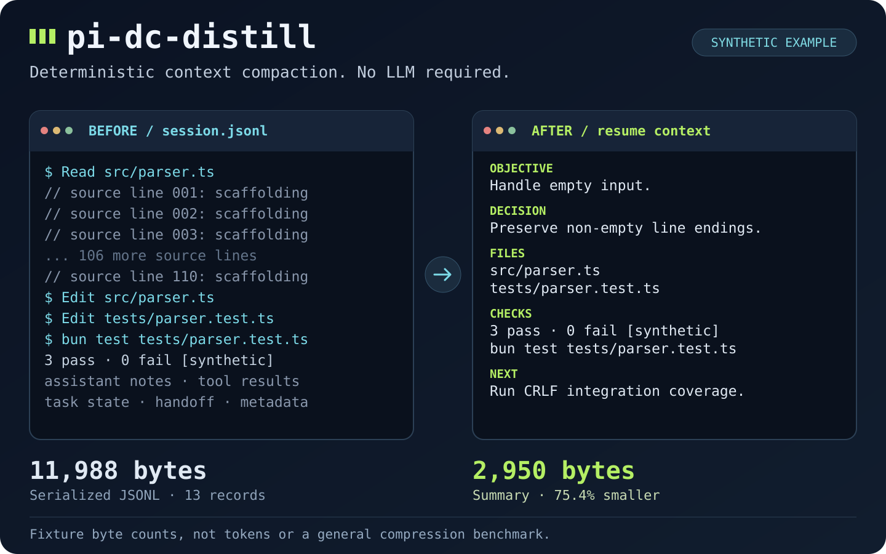

# pi-dc-distill

**Deterministic context compaction. No LLM required.**

[](LICENSE)
[](https://bun.sh)
[](https://github.com/earendil-works/pi)



pi-dc-distill is a compaction extension for
[Pi](https://github.com/earendil-works/pi). When a session grows long, it
turns the old conversation into a summary you can resume work from: it
extracts the objective, decisions, file observations, and verification
receipts, and drops repetition and low-signal content to stay under a fixed
budget. A local, rule-based compiler produces the summary — no LLM call is
involved.

The priority is an accurate account of the previous session, useful continuity,
and readable context, followed by compression. A smaller summary is useful only
when it preserves the obligations, decisions, evidence, and context needed to
resume. Fewer bytes or repetition markers do not prove summary quality.

The split of responsibility is simple: Pi owns `/compact`, decides which
entries to keep, and rebuilds the conversation. pi-dc-distill compiles only
the entries Pi discards, and its result replaces Pi's default LLM summary
for that attempt. This is lossy extraction; there is no guarantee that all
meaning survives. See
[how the mechanism works](docs/algorithm.md#what-happens-to-a-long-session)
for the full sequence, the trigger/interception distinction, metric units,
and known verification-evidence risks.

Version 13 carries validated declarations, explicit user-source pins, evidence, and failure history in a durable checkpoint. Their retention is protected across compactions; terminal prose cannot clear unresolved work. Other context remains lossy. Checkpoint updates use exact sources and stale-base rejection; invalid expected state or protected overflow cancels compaction.

Optional conversation previews shorten exact adjacent repetitions in eligible
background prose before clipping, retaining one phrase and an explicit repetition
count. This display cleanup preserves the original semantic preview used for
selection and evidence handling, and leaves checkpoint state unchanged. It is
mechanical and lossy; it makes no guarantee about subjective importance. See
[display cleanup](docs/algorithm.md#optional-prose-display-cleanup) for bounds and
conservative bypasses.

Version 12 adds conservative unknown-tool fencing, structural parsing, locale-independent wire output, and rebuilt-context capacity acceptance. Version 11 preserves conservative shell/output evidence, adds transcript-derived
rerun priorities and observed v3 handoff readiness, and improves summary ordering.
Version 12 restores the baseline production selector after the coverage candidate
failed its ordinary-workload performance gate. Coverage remains available in the
offline evaluator. See the [adoption decision](docs/algorithm.md#version-11-adoption-decision)
for measurements and reproducible commands. Offline evidence does not establish
installed Pi behavior, model resumption quality, attention gains or cache hits.

Two optional features — oversized tool-output previews and project-scoped
recall — are independent of each other and **off by default**. Enable them
only if you want the extra local storage and context behavior they add.

## Install

Requirements:

- Node.js 22.19.0 or newer
- Pi 1.0.0 or 1.0.2, the runtimes this package was reviewed against
- Bun 1.4.0, needed only for the packaged `dc-distill-session` replay CLI
  and the development commands below

Install from npm:

```bash
pi install npm:pi-dc-distill
```

Or from GitHub:

```bash
pi install git:github.com/dotcommander/pi-dc-distill
```

Pi loads the TypeScript extension directly; no compiled build is required.
If you are upgrading from the previous `pi-dc-shrink` package, remove or
disable it before loading this one.

Start a new Pi session in your project. Once enough context has accumulated:

```text
/compact preserve the parser repair, modified files, and remaining verification
```

Expand the compaction card to inspect the summary. A manual compaction
leaves choosing the next action to you. Automatic compaction runs on its
own: as context approaches Pi's limits, the monitor checks after each turn
settles (Pi's `agent_settled` boundary) and can queue a continuation
message once the summary commits. The observer and `ctx.compact()` are separate operations. A later user turn or manual/foreign compaction supersedes an older continuation.

## Optional features

Both features are opt-in. Merge the block below into Pi's global or project
settings — keep any keys already present — then start a new session. The
example enables both; each `enabled` flag works independently:

```json
{
  "extensionConfig": {
    "dc-distill": {
      "toolOutput": {"enabled": true},
      "recall": {"enabled": true}
    }
  }
}
```

With no opt-in (the default):

- Tool results are left untouched, and no tool-output artifacts or new
  recall summaries are written.
- No extra recall or focus echo is injected into context.
- The `recall_compaction` tool still responds, but reports that recall is
  disabled without reading stored summaries.
- Existing data is preserved. Core session compaction, handoffs, normal
  compaction metadata/logs, and continuation recovery all keep working.

After a validated v13 host commit, logs, dumps, recall and notifications run as
independent best effort effects. Continuation recovery uses the active-branch
journal and a process submission fence. Reloads and tree navigation preserve
possible-submission fences; a true process restart recovers from the journal.
Pi supplies no send acknowledgement, so uncertain submission does not promise
exactly-once execution or zero lost turns.

See [feature settings](docs/settings.md#optional-feature-settings) for
storage paths, inheritance, migration deferral, and what enabling each
feature changes.

## Try a repeatable comparison

From a checkout with Bun installed:

```bash
bun install --frozen-lockfile
bun run distill:compare
```

The command replays a [synthetic session](tests/fixtures/parser-session.jsonl),
prints the retained summary, and checks that its objective, decisions,
modified-file observations, verification status, and next action survive.
It also checks that the output is byte-for-byte deterministic.

Current fixture result:

```text
Before: 11988 UTF-8 bytes of serialized JSONL (13 records)
After:  3913 UTF-8 bytes of summary (67.4% smaller)
```

These numbers describe this fixture only — they are not model-token
estimates or a general compression benchmark. The fixture's test lines are
recorded data, not real executions: the comparison checks that the recorded
evidence is preserved, not that the sample parser's tests were run.
Artifacts are written to
`~/.pi/agent/cache/dc-distill/compare/<unique-run>/`.

## Use

| Task | Interface |
| --- | --- |
| Compact now | `/compact` or `/compact <focus>` |
| Save explicit task state | Agent tool `save_distill_handoff`, with a non-empty `handoff` string and optional schema-v1 `checkpoint` operations. |
| Search retained summaries | Opt-in agent tool `recall_compaction`, with `query`, optional `limit`, and optional `scope`; reports disabled unless recall is enabled. |
| Recover full tool output | Read the artifact path in its preview notice. |
| Replay a session from a checkout | `bun run distill:session -- <session.jsonl>` |

The handoff and recall interfaces are agent tools. Pi's `/compact` is the
only slash command involved. See [usage](docs/usage.md) for arguments and
examples.

## Policy and limits

Pi's own global and project compaction settings drive the autonomous
monitor. `compaction.enabled: false` turns it off; manual compaction
remains available. The extension adds no trigger settings of its own. Core
logs and optional recall/output artifacts live under
`~/.pi/agent/data/dc-distill/`. Raw input dumps are also off by default and
are enabled separately with `DC_DISTILL_DUMPS=1`. Diagnostics are written
to `diag.log` and `diag.ndjson` in that same directory; each rotates once
it exceeds 5 MiB, and rotated history is kept. See
[architecture](docs/architecture.md#shared-recall-and-diagnostics) for
diagnostic path details and the removed legacy recall deep imports.

The compiler is rule-based and lossy. It can miss subjective context and
low-signal details, so a handoff or focus hint helps mark what matters.
File observations and test receipts are captured evidence — they do not
prove current Git state or that a check is still fresh. If compilation
fails, the compaction is cancelled; it never falls back to an LLM summary.

The summary targets 8,192 Unicode code points, with a hard wire limit of
65,536. Entries Pi retains stay in context untouched, and abandoned
branches never enter the compiler. See [policy and data](docs/settings.md)
for storage, retention, triggers, and
[migration from the previous name](docs/settings.md#upgrading-from-pi-dc-shrink).

## Development and documentation

Direct dependencies are pinned and resolved in `bun.lock`: the development
SDK baseline is Pi 0.99.2, while the reviewed installed runtime is Pi 1.0.0 and 1.0.2.
Checks run offline after installation:

```bash
bun test
bun run typecheck
bun run distill:architecture
git diff --check
```

`bun run distill:quality /absolute/path/to/artifacts quality-v13` evaluates
checkpoint correctness and the separate optional selector.
`bun run distill:performance /absolute/path/to/artifacts candidate-v13 /absolute/path/to/baseline.checkpoint.json`
runs the sealed checkpoint benchmark and matched ordinary-workload gate; see
[Compiler benchmarks](docs/compiler-benchmark.md) for baseline preparation,
memory geometry, and the historical-comparison limits. Both write local receipts.

`bun run distill:demo` runs one manual lifecycle through installed Pi RPC
with a scripted provider. `bun run distill:e2e` also tests automatic
compaction and restart recovery; its automatic case includes the production
120-second cooldown. Both use isolated data directories and make no
provider/network requests. Select each reviewed host explicitly using the
[RPC acceptance instructions](tests/e2e/README.md).

- [Usage](docs/usage.md): compaction, handoffs, recall, output previews, replay.
- [Policy and data](docs/settings.md): settings, local storage, migration.
- [Troubleshooting](docs/troubleshooting.md): diagnostics and compatibility.
- [Architecture](docs/architecture.md): ownership, lifecycle, isolation, metrics.
- [Algorithm](docs/algorithm.md): scoring, repetition, evidence, eviction.
- [Compiler benchmarks](docs/compiler-benchmark.md): offline compilation performance and memory efficiency.
- [Architecture decisions](docs/adr/0002-remove-vendored-framework.md): vendoring boundary and framework separation decisions.
- [Releasing to npm](docs/releasing.md): package checks, authentication, publication.

[MIT license](LICENSE).

Checkpoint schema v1 protects validated declared tasks and explicit user-source
pins, without inferring every implied obligation or authorization. Updates return
canonical sources and a base identity for the next atomic update. Resolution cannot
manufacture verification or waive authorization. Summaries contain no metric line;
committed details and notifications report host-consistent token estimates.
Historical v5–v12 entries remain readable. Rollback requires a v13-aware reader
or refusal to discard checkpoint state.

Continuation intent, submission, and resulting work are distinct. Pi has no durable
send acknowledgement, so a crash between acceptance and journal persistence
leaves an uncertain interval; recovery cannot promise exactly-once work.
